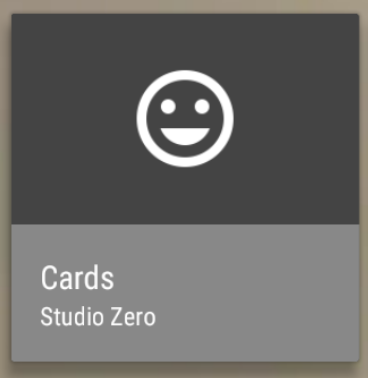

Leanback Extensions
========

<p align="center">
    
</p>

Extensions of Leanback Support Library for Android TV.

[  ](https://bintray.com/fasteque/maven/leanback-extensions/_latestVersion) [](https://travis-ci.org/fasteque/leanback-extensions)

LoadingFragment
--------
A simple fragment with an indeterminate `ProgressBar` in the center. `ProgressBar` and fragment background color are customizable.<br>
`LoadingFragment` is not a `BrandedFragment` subclass.

Please refer to the [sample](https://github.com/fasteque/leanback-extensions/blob/master/app/src/main/java/com/fasteque/leanback/sample/LoadingActivity.java) application for more details about its usage.

JustifiedVerticalGridPresenter
--------
A `Presenter` that renders objects in a `VerticalGridView`, filling rows starting from the left.<br>
When are there less items in a row than its maximum capacitiy, they will placed anyway starting from the left (contrary to the default Android TV behaviour).

IconCardView
--------
A subclass of `BaseCardView` which displays a main `ImageView` and two lines of texts. `ImageView`, texts, texts and card background colors are customizable.

<p align="center">
    
</p>

Please refer to the [sample](https://github.com/fasteque/leanback-extensions/blob/master/app/src/main/java/com/fasteque/leanback/sample/IconCardPresenter.java) application for more details about its usage.

LoadingCardView
--------
A subclass of `BaseCardView` which displays an indeterminate `ProgressBar` in the center. `ProgressBar` and card background color are customizable.

<p align="center">
    
</p>

Please refer to the [sample](https://github.com/fasteque/leanback-extensions/blob/master/app/src/main/java/com/fasteque/leanback/sample/LoadingCardPresenter.java) application for more details about its usage.

OverlayCardView
--------
A subclass of `BaseCardView` which displays a main `ImageView` and an overlay `ImageView` on top of it. `ImageView`s are card background color are customizable.

<p align="center">
    
</p>

Please refer to the [sample](https://github.com/fasteque/leanback-extensions/blob/master/app/src/main/java/com/fasteque/leanback/sample/OverlayCardPresenter.java) application for more details about its usage.

ProcessCardView
--------
A subclass of `BaseCardView` which displays a main `ImageView` and a loading overlay on top of it. The overlay contains an indeterminate `ProgressBar` and a `ImageView`. All card components are customizable.

<p align="center">
    
</p>

Please refer to the [sample](https://github.com/fasteque/leanback-extensions/blob/master/app/src/main/java/com/fasteque/leanback/sample/ProcessCardPresenter.java) application for more details about its usage.

Download
========

Gradle:
```groovy
compile 'com.fasteque:leanback-extensions:0.0.4'
```

Please read the [CHANGELOG](https://github.com/fasteque/leanback-extensions/blob/master/CHANGELOG.md) to know which version of the Android Leanback Support Library is used by the extensions to match the one in your application.

Acknowledgments
========

Thanks to [LeanbackCards](https://github.com/hitherejoe/LeanbackCards), which was really helpful when I started developing for Android TV and lead me to release this library.

License
========

      Copyright 2017 Daniele Altomare

      Licensed under the Apache License, Version 2.0 (the "License");
      you may not use this file except in compliance with the License.
      You may obtain a copy of the License at

          http://www.apache.org/licenses/LICENSE-2.0

      Unless required by applicable law or agreed to in writing, software
      distributed under the License is distributed on an "AS IS" BASIS,
      WITHOUT WARRANTIES OR CONDITIONS OF ANY KIND, either express or implied.
      See the License for the specific language governing permissions and
      limitations under the License.
